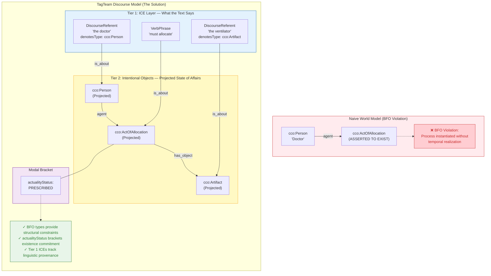

# Philosophical Foundations of TagTeam: A Defense of Discourse-Model Semantics

**Version 1.0 | February 2026**

---

## Abstract

TagTeam.js has been critiqued by practitioners of the Smith/Ruttenberg school of Ontological Realism for apparent violations of Basic Formal Ontology (BFO) principles, particularly regarding the instantiation of non-existent entities. This essay argues that these critiques, while technically accurate under a strict world-model interpretation, misconstrue the semantic domain TagTeam is designed to represent. TagTeam is not a world model—it is a *discourse model*. Its ABox represents what texts *say about* reality, not reality itself. This distinction, grounded in Discourse Representation Theory and the phenomenological tradition that informs BFO's own philosophical foundations, renders the realist critiques inapplicable to TagTeam's actual use case while preserving the ontological rigor that BFO alignment provides.

---

## 1. The Realist Critique

### 1.1 Summary of Objections

A recent expert review of the TagTeam ontology suite identified three categories of potential BFO violations:

**The Process Existence Paradox.** TagTeam's `would_be_realized_in` property links BFO Roles to BFO Processes. When the target process has an `actualityStatus` of `Planned`, `Prescribed`, or `Hypothetical`, the reviewer argues that instantiating that process in the ABox constitutes an ontological commitment to its existence—a commitment that cannot be satisfied for events that have not occurred.

> "In OWL, if you link `Role_X` via this property to `Process_Y`, you are asserting that `Process_Y` exists. If `Process_Y` is 'Hypothetical' or 'Planned,' it does not exist in reality. BFO is strictly for *existing* entities."

**Strings versus Things.** TagTeam uses datatype properties (specifically `xsd:string`) to record type information, such as `denotesType` linking a `DiscourseReferent` to a class IRI represented as a string. The critique holds that this "cripples semantic reasoning" because OWL reasoners cannot traverse string values to infer subsumption relationships.

**Absent Entity Reference.** The `ScarcityAssertion` class links to resources via `scarceResource`, with range `bfo:Object`. The reviewer notes that when scarcity indicates absence ("no food left"), one cannot coherently point to the absent food, as "you can't point to the food that isn't there."

### 1.2 The Standard Being Applied

These critiques apply the standard of **Ontological Realism** as articulated by Barry Smith and collaborators. Under this view:

1. An ontology's ABox should contain only entities that exist in the spatiotemporal world.
2. BFO classes (Continuant, Occurrent, etc.) are universals instantiated by real particulars.
3. OWL assertions carry existential import: `inst:X a bfo:Process` entails that X exists.
4. Ontologies should support Description Logic reasoning as a primary use case.

This standard is appropriate for biomedical ontologies like the Gene Ontology, Disease Ontology, or ontologies supporting clinical decision support where the ABox represents actual patients, actual diagnoses, and actual biological processes.

The question is whether this standard is appropriate for TagTeam.

---

## 2. TagTeam's Actual Semantic Domain

### 2.1 The Fundamental Distinction

TagTeam does not model the world. TagTeam models **what texts say about the world**.

This is not a subtle distinction. It is the difference between:

- **World Model**: "There exists a flight from New York to London departing at 3pm."
- **Discourse Model**: "The text asserts that there exists a flight from New York to London departing at 3pm."

The first commits the speaker to the flight's existence. The second commits the speaker only to the text's *saying* something—regardless of whether what the text says is true, false, planned, hypothetical, or counterfactual.

TagTeam's two-tier architecture explicitly encodes this distinction:

| Tier | Contains | Ontological Status |
|------|----------|-------------------|
| **Tier 1** (ICE Layer) | DiscourseReferents, VerbPhrases, DirectiveContent | What the text *says* |
| **Tier 2** (Intentional Object Layer) | Persons, Artifacts, Processes typed to BFO/CCO | What the text *is about* |

The `cco:is_about` relation bridges these tiers. A `DiscourseReferent` for "the planned flight" is *about* an intentional object—but that aboutness relation does not entail the object exists in the world. It entails only that the object exists *as intended by the discourse*.

### 2.2 Theoretical Foundations

This approach has robust theoretical grounding in traditions that directly inform BFO's own philosophical commitments.

**The Phenomenological Tradition.** Barry Smith's work on formal ontology is deeply influenced by the phenomenology of Franz Brentano and Edmund Husserl. Brentano's thesis of **intentionality** holds that mental acts are characterized by their *directedness toward objects*—and crucially, these objects need not exist. One can think about Pegasus, plan a vacation that never occurs, or fear a danger that never materializes. The intentional object exists *as intended*, regardless of whether it exists *in the world*.

Husserl refined this with the concept of **noematic content**—the object-as-intended, analyzed independently of questions about actual existence. The **phenomenological epoché** suspends judgment about whether the intentional object corresponds to anything real, allowing rigorous analysis of the object's intended features without ontological commitment.

TagTeam implements a computational epoché. Its Tier 2 entities are representations of intentional objects—the correlates of linguistic acts that may or may not have worldly referents.

**Discourse Representation Theory (DRT).** Developed by Hans Kamp and Uwe Reyle, DRT provides formal semantics for natural language that explicitly represents discourse referents—entities introduced by linguistic expressions that may or may not correspond to real-world individuals. DRT discourse referents for "a unicorn" in "John seeks a unicorn" do not commit the model to unicorns existing. TagTeam's `DiscourseReferent` class implements this concept.

**Situation Semantics.** Barwise and Perry's situation semantics distinguishes between situations (partial states of affairs) and the world (the maximal situation). Texts describe situations, not the world directly. TagTeam's `ActualityStatus` vocabulary (`Actual`, `Hypothetical`, `Prescribed`, `Negated`) provides the modal operators needed to locate described situations relative to the actual world.

**Information Artifact Ontology (IAO).** The IAO, developed within the OBO Foundry ecosystem and aligned with BFO, provides the class `Information Content Entity` (ICE)—entities that are *about* other entities. TagTeam's entire Tier 1 layer consists of ICE subclasses. The IAO explicitly acknowledges that information can be *about* non-existent things (plans, fictions, errors) without thereby instantiating them.

### 2.3 What TagTeam's ABox Actually Contains

When TagTeam processes "The doctor must allocate the last ventilator," it produces a graph with clear separation between linguistic content and projected states of affairs:

```turtle
# Tier 1: What the text says (Information Content Entities)
inst:DR_doctor a tagteam:DiscourseReferent ;
    tagteam:denotesType "cco:Person" ;
    cco:is_about inst:Person_Doctor_001 .

inst:DR_ventilator a tagteam:DiscourseReferent ;
    tagteam:denotesType "cco:Artifact" ;
    tagteam:scarcityMarker "last" ;
    cco:is_about inst:Artifact_Ventilator_001 .

# Tier 2: Intentional objects (Projected State of Affairs)
inst:Person_Doctor_001 a cco:Person .
inst:Artifact_Ventilator_001 a cco:Artifact .

inst:Act_Allocate_001 a cco:ActOfAllocation ;
    tagteam:actualityStatus tagteam:Prescribed ;
    cco:has_agent inst:Person_Doctor_001 .
```

The Tier 2 entities exist as **intentional objects**—the correlates of the text's referential and predicative acts. The `actualityStatus` property functions as a modal operator that tells any consumer: "The text presents this act as obligatory, not as having occurred."

This is analogous to how a library catalog contains entries for books about unicorns without the library thereby containing unicorns. The catalog entry exists; the unicorn does not. The entry is *about* unicorns without unicorns existing.

---

## 3. Responding to the Specific Critiques

### 3.1 The Process Existence Paradox

**Critique**: Instantiating `inst:Flight_Process_01` with `actualityStatus: Planned` violates BFO because planned processes don't exist. In BFO, classes are disjoint: an entity cannot simultaneously be a `bfo:Process` (which unfolds in time) and a discourse object (which represents). If TagTeam types something as `cco:ActOfAllocation`, it must have temporal parts—but a planned act has no temporal parts because it hasn't happened.

**Response**: This critique is technically correct under a naive reading, but it misunderstands the semantic architecture TagTeam employs. We must distinguish between three things:

1. **The ontological category** of an entity (what it *is* in the world)
2. **The representational role** of a node in the graph (what it *models*)
3. **The type vocabulary** used to describe features (what *constraints* apply)

TagTeam's Tier 2 entities are not processes, persons, or artifacts in the BFO world-model sense. They are representations of **intentional objects**—the noematic correlates of linguistic acts that may or may not have worldly referents.

#### The Husserlian Framework

This distinction has deep roots in the phenomenological tradition that informs Barry Smith's own philosophical work. Brentano's thesis of intentionality holds that mental acts are characterized by their directedness toward objects—and crucially, these objects need not exist. I can think about Pegasus, plan a vacation I may never take, or fear a danger that never materializes. The intentional object of my thought exists *as intended*, regardless of whether it exists *in the world*.

Husserl's phenomenological epoché suspends judgment about whether the intentional object corresponds to anything real, allowing rigorous analysis of the object's intended features without ontological commitment to its worldly existence.

TagTeam implements a **computational epoché**. When we write:

```turtle
inst:Act_Allocate_001 a cco:ActOfAllocation ;
    tagteam:actualityStatus tagteam:Prescribed .
```

The triple `inst:Act_Allocate_001 a cco:ActOfAllocation` should be interpreted within the scope of the graph's modal context. It asserts that the entity satisfies the **definition** of an Allocation (intension), not that it belongs to the **extension** of actual allocation events. The `actualityStatus` property provides the modal bracket that scopes this interpretation:

1. The text presents an intentional object (something the text is *about*)
2. This intentional object, *as intended by the text*, has the features definitive of an act of allocation
3. The text's modal stance toward this object is prescriptive (it *should* happen), not assertoric (it *did* happen)

The BFO type `cco:ActOfAllocation` functions here as a **feature specification**, not an existence claim. It tells us that the intentional object—if it were to be realized—would be an act of allocation, with an agent, a patient, a transferred resource, and so forth. These features constrain valid graphs (agents must be animates, allocated resources must be continuants) without asserting that any actual allocation has occurred.

#### The Projected State of Affairs

Another formulation: TagTeam's Tier 2 entities represent **projected states of affairs**—possible, obligatory, or hypothetical configurations of the world as depicted in discourse.

Consider "The physician must administer the medication." This text projects a state of affairs: a future situation in which a physician-administration-medication configuration obtains. TagTeam represents this projection with the `actualityStatus` functioning as a modal operator that scopes the entire subgraph:

| actualityStatus | Modal Interpretation |
|-----------------|---------------------|
| `Actual` | The text asserts this state of affairs obtains |
| `Prescribed` | The text asserts this state of affairs is obligatory |
| `Permitted` | The text asserts this state of affairs is allowed |
| `Hypothetical` | The text considers whether this state of affairs might obtain |
| `Negated` | The text asserts this state of affairs does not obtain |

This is structurally identical to how modal logic represents `□p` (necessarily p) versus `◇p` (possibly p) versus `¬p` (not p). The proposition p has the same internal structure in each case; the modal operator determines its relationship to actuality.

#### Why BFO Types Remain Appropriate

One might ask: if these are intentional objects, not real processes, why type them with BFO classes at all? Why not create a parallel hierarchy of `IntendedProcess`, `IntendedPerson`, `IntendedArtifact`?

Three reasons:

**Structural inheritance.** BFO and CCO provide a rich vocabulary of relations and constraints. An `ActOfAllocation` has agents, patients, and allocated resources; participants must be of appropriate types; temporal relations hold between acts. By using BFO/CCO types, TagTeam inherits these structural constraints without reimplementing them. A projected allocation still has the *structure* of an allocation, even if it lacks the *existence* of one.

**Interoperability.** Downstream systems consuming TagTeam output may need to reason about the entities described. A clinical decision support system processing "The physician should prescribe antibiotics" benefits from knowing that the prescribed act would be a `cco:ActOfPrescribing`, the prescribed substance would be a `cco:Antibiotic`, and the patient would be a `cco:Patient`. These types enable query and inference even over non-actual entities.

**Parsimony.** Creating shadow hierarchies (`IntendedProcess` paralleling `bfo:Process`, etc.) would double the ontology's size, introduce synchronization problems, and require every consumer to handle two parallel type systems. The `actualityStatus` property achieves the same disambiguation with a single additional triple per entity.

#### The Demand for Impossibility

To demand that a discourse model instantiate `bfo:Process` only for actual events is to render the modeling of plans, orders, hypotheses, and counterfactuals impossible. Every legal code prescribes acts that may never occur. Every medical protocol describes treatments that may never be administered. Every strategic plan projects operations that may never be executed. Every conditional statement entertains states of affairs that may never obtain.

If ontology cannot represent these, ontology cannot represent language. TagTeam chooses to represent language faithfully, using BFO's structural vocabulary while bracketing BFO's existential commitments through the `actualityStatus` mechanism.

The phenomenological tradition—Smith's own philosophical lineage—provides the conceptual tools to understand this move. TagTeam's graph is a representation of noematic content: the object-as-intended, with its intended features, bracketed from the question of worldly existence. The BFO types specify features; the `actualityStatus` specifies the modal bracket.

### 3.2 Strings versus Things

**Critique**: Using `xsd:string` for `denotesType` prevents OWL reasoners from inferring subsumption relationships.

**Response**: This is a feature, not a bug—and it is architecturally necessary for two distinct reasons.

#### The Endorsement Problem

TagTeam's `denotesType` records **what type the text attributes to an entity**, not what type the entity actually has. Consider:

> "The witness described the perpetrator as a tall man."

TagTeam creates a DiscourseReferent with `denotesType: "cco:Person"`. But this is the *witness's* classification, not an ontological fact. If the perpetrator were actually a cleverly disguised automaton, the text would still attribute personhood. TagTeam correctly records the attribution without endorsing it.

If `denotesType` were an object property with range `owl:Class`, the triple `inst:DR_perpetrator tagteam:denotesType cco:Person` would entail (via OWL metamodeling or punning) that the referent *is* a person. This conflates what the text *says* with what *is the case*—precisely the distinction TagTeam exists to preserve.

#### The Decidability Problem

Natural language generates indefinitely many noun phrase types: "the tall man," "the tall man in the red hat," "the tall man in the red hat who arrived yesterday." Elevating these to formal OWL classes would require "shadow classes" for every distinct noun phrase, causing explosive growth of the TBox (terminological box).

This would likely render the ontology **undecidable** or computationally intractable for real-time parsing. The use of `xsd:string` for `denotesType` is a deliberate architectural choice to keep combinatorial complexity in the ABox (data layer) rather than the TBox (schema layer). The ABox can grow with the corpus; the TBox remains fixed and tractable.

For consumers who require reasoning, TagTeam provides:

- The Tier 2 entity (linked via `cco:is_about`) with actual BFO/CCO typing where warranted
- SHACL validation for structural constraints that do not require DL inference
- The interpretation lattice for explicit representation of type ambiguity

OWL DL reasoning is not TagTeam's primary use case. Auditability, human interpretability, and faithful representation of textual content are.

### 3.3 Absent Entity Reference

**Critique**: `scarceResource` cannot coherently point to absent food when representing "no food left."

**Response**: This critique misreads the semantics of scarcity representation.

TagTeam's `ScarcityAssertion` represents the text's claim that a resource type is scarce—not a pointer to absent individuals. When processing "There is no food left," TagTeam creates:

```turtle
inst:ScarcityAssertion_001 a tagteam:ScarcityAssertion ;
    tagteam:scarceResource inst:DR_food ;
    tagteam:supplyCount 0 .

inst:DR_food a tagteam:DiscourseReferent ;
    tagteam:denotesType "cco:Food" ;
    rdfs:label "food" .
```

The `DiscourseReferent` is a linguistic object—an ICE representing the text's reference to food. It exists as information content. The `scarceResource` property links the scarcity assertion to this discourse referent, not to any actual food.

The `denotesType` property indicates *what kind of thing* the text discusses (food). The `supplyCount` of zero indicates the text's claim that none is available. At no point does TagTeam instantiate absent food or attempt to point to something that doesn't exist.

This parallels how a shopping list item "milk" refers to milk without instantiating any particular milk. The list item is *about* a type; it does not contain a token. TagTeam's scarcity assertions work identically: they are *about* resource types, asserting something about their availability, without conjuring absent individuals into existence.

The `scarceResource` property's range of `bfo:Object` in the ontology specification should be understood as applying to the *intended referent* of the discourse referent—the thing that would satisfy the reference if it existed. This is another application of the intentionality framework: we can refer to, discuss, and make claims about things that do not exist, because reference is an intentional relation, not a physical one.

---

## 4. Architectural Summary: Two Tiers, Two Commitments

The following diagram illustrates the distinction between a naive world-model interpretation (which would indeed violate BFO) and TagTeam's actual discourse-model architecture:



**The key architectural insight**: TagTeam uses BFO vocabulary to describe the **structure** of intentional objects while using `actualityStatus` to **bracket** questions of their worldly realization. This is not a violation of BFO principles—it is an application of phenomenological method to computational semantics, using the structural resources BFO provides without the existential commitments BFO's world-model interpretation would impose.

---

## 5. The Deeper Issue: Fitness for Purpose

### 5.1 Different Ontologies for Different Purposes

The OBO Foundry community has developed ontologies for biomedicine where the ABox contains real patients, real genes, and real diseases. For these purposes, strict adherence to BFO realism is essential: a clinical decision support system must not confuse planned treatments with administered treatments.

TagTeam serves a different purpose: **parsing natural language into structured representations that preserve the modal, temporal, and referential nuances of the original text**. This requires representing:

- What texts claim happened (actual)
- What texts claim should happen (deontic)
- What texts consider might happen (epistemic)
- What texts deny happened (negation)
- What texts discuss without asserting existence (hypothetical)

A world-model ontology cannot represent these distinctions without violating its own foundational assumptions. A discourse-model ontology must represent them to be faithful to its subject matter.

### 5.2 BFO Alignment as Structural Inheritance

TagTeam uses BFO and CCO not as a claim that its ABox entities exist in the spatiotemporal world, but as a **structural vocabulary** for typing intentional objects.

When TagTeam types an act as `cco:ActOfAllocation`, it means: "This intentional object, if actual, would be an act of allocation." The BFO/CCO type provides:

- **Consistent vocabulary** across different texts and domains
- **Selectional restrictions** (agents must be animates, patients of medical acts must be persons)
- **Inheritance of properties** (acts have participants, continuants have qualities)

This is analogous to how a film script uses character types (Hero, Villain, Mentor) without claiming heroes exist. The types structure the representation without making ontological commitments about the represented.

### 5.3 Validation Through SHACL, Not OWL

TagTeam's quality assurance relies on SHACL constraint validation, not OWL reasoning. This is appropriate because:

1. **SHACL operates under closed-world assumption**, which matches TagTeam's use case (validating that a graph is complete and well-formed)
2. **SHACL can enforce modal constraints** (e.g., "if `actualityStatus` is not `Actual`, use `would_be_realized_in` rather than `realized_in`")
3. **SHACL validates data quality** (missing labels, type mismatches) without requiring DL consistency

The expert reviewer's suggestion to create SHACL shapes is already implemented. TagTeam's `SHMLValidator` enforces eight expert-certified patterns derived from BFO/CCO axioms, including the constraint that `would_be_realized_in` must only be used for non-actual processes.

---

## 6. Precedents and Parallels

### 6.1 Modal and Temporal Extensions to BFO

The broader BFO community has acknowledged the need for modal and temporal extensions. The BFO 2020 specification includes temporal relations and allows for the representation of entities at different times. Work on BFO-based deontic ontologies (for representing norms, obligations, and permissions) faces exactly the same challenges TagTeam addresses.

If I say "Physicians must wash their hands," a deontic ontology must represent the hand-washing act despite it not (yet) having occurred. This is structurally identical to TagTeam's representation of prescribed acts.

### 6.2 The Event Ontology and Music Ontology

The Event Ontology and Music Ontology, used in linked data applications, routinely represent future events (concerts not yet performed), cancelled events (performances that will never occur), and hypothetical events (proposed but unconfirmed performances). These ontologies instantiate events as discourse objects, with properties indicating their temporal and modal status.

TagTeam's approach is directly analogous.

### 6.3 Dublin Core and FOAF

Metadata ontologies like Dublin Core and FOAF regularly describe documents *about* entities without asserting those entities exist. A Dublin Core description of a novel about dragons does not instantiate dragons. The metadata exists; the dragons do not.

TagTeam generalizes this pattern from document metadata to document content.

---

## 7. Conclusion

The Smith/Ruttenberg critique of TagTeam applies a world-model standard to a discourse-model system. This represents a category error in evaluation.

TagTeam does not claim that planned flights exist, that hypothetical treatments have occurred, or that absent food is present. TagTeam claims that **texts say things about flights, treatments, and food**—and it represents what texts say with sufficient precision to preserve modal, temporal, and referential distinctions.

The apparent BFO violations dissolve when the ABox is correctly understood as representing intentional objects, not world objects. The `actualityStatus` vocabulary provides the modal operators needed to distinguish "the text says X happened" from "the text says X should happen" from "the text considers whether X might happen."

This design is:

- **Theoretically grounded** in Discourse Representation Theory and the Husserlian phenomenology that informs BFO's own philosophical foundations
- **Practically aligned** with existing metadata and event ontologies
- **Fit for purpose** as a semantic interpretation engine for natural language

TagTeam's alignment with BFO and CCO provides vocabulary, structure, and interoperability. It does not commit TagTeam to ontological realism about intentional objects any more than a library catalog commits the library to the existence of fictional characters.

The realists are right that BFO is strictly for existing entities. They are wrong that TagTeam violates this principle. TagTeam's entities exist—as intentional objects in discourse. What those intentional objects are *about* may or may not exist in the world. That distinction is precisely what TagTeam is designed to capture.

By invoking the phenomenological epoché—the methodological bracketing of existence claims that Husserl pioneered and that informs Smith's own philosophical work—TagTeam demonstrates that rigorous ontological modeling and faithful discourse representation are not merely compatible but mutually reinforcing. The BFO types provide the structural vocabulary; the `actualityStatus` provides the modal bracket. Together, they enable what neither could accomplish alone: a computationally tractable, ontologically grounded representation of what natural language texts say about the world.

---

## Acknowledgments

This defense draws on the Discourse Representation Theory of Hans Kamp and Uwe Reyle, the phenomenological tradition of Franz Brentano and Edmund Husserl, the Information Artifact Ontology developed by the OBO Foundry community, and the ongoing work on BFO-based deontic ontologies. The expert review that prompted this response, while ultimately applying an inapt evaluative standard, raised important questions that clarified TagTeam's theoretical foundations and strengthened its philosophical grounding.

---

## References

Arp, R., Smith, B., & Spear, A. D. (2015). *Building Ontologies with Basic Formal Ontology*. MIT Press.

Barwise, J., & Perry, J. (1983). *Situations and Attitudes*. MIT Press.

Brentano, F. (1874/1995). *Psychology from an Empirical Standpoint*. Routledge.

Ceusters, W., & Smith, B. (2015). Aboutness: Towards Foundations for the Information Artifact Ontology. *Proceedings of ICBO 2015*.

Husserl, E. (1913/1983). *Ideas Pertaining to a Pure Phenomenology and to a Phenomenological Philosophy*. Martinus Nijhoff.

Kamp, H., & Reyle, U. (1993). *From Discourse to Logic: Introduction to Model-theoretic Semantics of Natural Language*. Kluwer Academic Publishers.

Smith, B., et al. (2015). Basic Formal Ontology 2.0: Specification and User's Guide. *National Center for Ontological Research*.

Smith, B., & Ceusters, W. (2010). Ontological realism: A methodology for coordinated evolution of scientific ontologies. *Applied Ontology*, 5(3-4), 139-188.

---

*This document is part of the TagTeam.js project documentation.*
*Location: `docs/research/DISCOURSE_MODEL_DEFENSE.md`*
*Version 1.0 | February 2026*